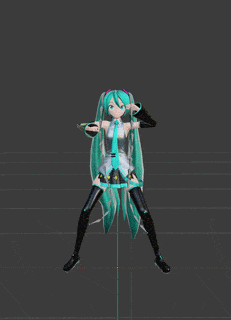
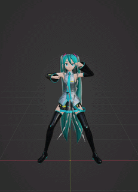

# Wiggle Bones
Wiggle Bones is a physics simulation add-on for Blender. It enables the bones to behave like dynamic springy rigid bodies, allowing for real time simulation of wiggly physics.

## Fork Notice
This project is based on [jurassicjordan's fork](https://github.com/jurassicjordan/blender-wiggle-2) of [Labhatorian's fork](https://github.com/Labhatorian/blender-wiggle-2) of the original [Wiggle 2 by shteeve3d](https://github.com/shteeve3d/blender-wiggle-2)  

Wiggle Bones is a partial refactor of the original **Wiggle 2** add-on, aiming to ensure compatibility with Blender 5.0 and newer and resolve some of the long standing issues it had, while maintaining the physics behavior of the original intact.

For a more detailed list of changes, check the [Fixes](#fixes--changes) section below.  

## Features

### Pinning
- By applying a damped track constraint on a wiggling bone, you can pin it to its target, allowing other bones to respond accordingly.

### Collision Support
- Bones can interact with specified meshes or collections, with options for friction, bouncing, or stickiness.

### Linking and Library Overrides
- Wiggle 2 supports library-linked assets, allowing for overrides that let you fine-tune your wiggle per scene.

### Baking Refinements
- A one-click bake feature converts visible wiggle bones into keyframes. Preroll options enable the simulation to settle, and the timeline looping option helps create seamless animations.

### Refreshed Interface
- Manage everything from a single panel in the 3D animation view for a streamlined, fullscreen workflow.

### (Work in Progress) Bone Pairs
This feature pairs bones and together with full collision detection generates an invisible plane between them, which is then used for collisions. 

Please note that this implementation is still experimental and might not work perfectly since it's a bit challenging to test and refine. You can explore the current code on the [Bone Pairs branch](https://github.com/Labhatorian/blender-wiggle-2/tree/bonepairs).

## Usage

1. **Install and Enable the Add-on**
   - Enable wiggle in your scene via the properties panel of the 3D viewport under the Animation tab. \
   

2. **Select an Armature Object** \
   

3. **Enable Wiggle on the Armature** \
   

4. **Select a Pose Bone** \
   

5. **Enable Wiggle on the Bone**
   - Choose to enable wiggle on the head or tail of the bone. Note: If the bone is connected to its parent, the head option will be unavailable. \
   

6. **Configure Bone Physics**
   - Adjust the bone's physics settings via the dropdowns for the head and tail. \
   

7. **Set Up Collision**
   - Select a collision object or collection to enable interactions, providing additional tuning options for collision behavior. \
   
   - **Full Bone Collision Option**: \
   
     - You can enable collision detection for the entire length of the bone by checking the **Enable Full Bone Collision** option in the _Global Wiggle Utilities_. This allows for more accurate collision interactions along the entire bone rather than just at the head or tail. 
     - Adjust the **Steps** setting to define how many interpolation points are used for the collision detection along the bone.
     - Set the **Collision Threshold** to determine the minimum movement distance considered for a collision, and the **Dot Threshold** for sensitivity during the collision check.

8. **Utilize Global Utilities**
   - The global utilities section offers functions like resetting physics, selecting all wiggling bones, and copying settings between bones. 
   - Note: You can adjust individual settings on multiple selected bones at once. 
   - 'Loop physics' prevents the physics from resetting during timeline loops, while 'Quality' sets the number of iterations of the constraint solver, enhancing rope simulations. \
   

9. **Bake Wiggle**
   - The Bake Wiggle sub-utility converts live physics simulations into keyframes, affecting all visible wiggle bones in the viewport. 
   - Overwrite merges keyframes into the armature's current action or creates a new one. Preroll runs the simulation for a specified number of frames, allowing it to settle, and works in tandem with 'Loop physics' for clean animated loops. \
   

10. **Legacy Wiggle Cleanup**
   - A utility made to clean up ID Properties left over by older versions of Wiggle 2. 
   - Optionally allows to transfer the old settings to the new Group-based properties before removing them.  
     

## Fixes & Changes
This version focuses on code cleanup, maintainability and compatibility with current versions of Blender. Below is a list of the principal changes introduced in this fork.  
   * Migrated properties to be stored on **Property Groups**:  
      * Previous versions of Wiggle 2 saved bone settings as ID properties, accessible as dictionary keys, which were never unregistered, and resulted in the properties being saved in the `.blend` file even when the add-on was not enabled.  
      * Now all properties reside on a single `wiggle` Property Group.  

   * Legacy data migration & cleanup:  
      * Added an operator to deal with the *"lint"* properties left behind by older versions of Wiggle 2, with the option to copy them to the new group-based structure.  

   * Code cleanup & bug fixes:  
      * Divided the monolith single file add-on into multiple, more easily workable files.  
      * Removed problematic syncing behavior.  
      * Fixed drawing of the *Collision Settings* panel.  
      * Fixed use of *Preroll* when baking the wiggle simulation.  

Please check the upstream forks for more details on their changes over the original Wiggle 2.  

### Comparison between original and new Wiggle
| New Wiggle Bones (Blender 5.1) | Original Wiggle 2 (Blender 3.6) |
| :---: | :---: |
|  |  |

Motion: The Spark by Epic, converted to vmd by LeomarieMMD & Hulasemoos.

## Other Cool Wiggle Forks
The following are two notable Wiggle 2 forks with different physics algorithms, each producing a distinct simulation. 

* [Jiggle Physics](https://github.com/naelstrof/blender-jiggle-physics) by naelstrof. 
      A fork of Wiggle 2 that implements a Verlet algorithm for the simulation. 

* [Wiggle 2: RTX Edition](https://github.com/mayalhc/blender-wiggle-2) by mayalhc. 
      A complete rewrite of Wiggle 2, implementing a new physics system. 

## License
Wiggle Bones is licensed under the [GNU General Public License, Version 3](./LICENSE). \
Individual files may have different, but compatible licenses. 
